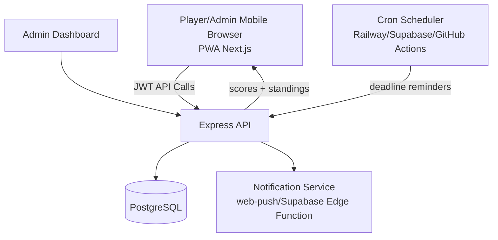

# Fantasy F1 Picks League Product Blueprint

## 1. Product Architecture Diagram



## 2. Database Schema

Implemented SQL is in `backend/src/sql/schema.sql`.

Core tables:
- `users`: auth, profile, role (`player` or `admin`)
- `leagues`: private league container
- `league_members`: users joined to leagues
- `races`: race weekend metadata, lock deadline, status, tie-breaker value
- `pick_categories`: admin-defined categories per race (pole, winner, P2, etc.)
- `picks`: player picks per category per race
- `results`: official results per category per race
- `scores`: calculated points per user per race
- `notifications`: push subscriptions + reminder events

## 3. API Endpoints

Base URL: `/api`

Auth:
- `POST /auth/register`
- `POST /auth/login`
- `POST /auth/password-reset` (placeholder for provider integration)

Races:
- `GET /races`
- `GET /races/:raceId`

Picks:
- `GET /picks/:raceId`
- `POST /picks/:raceId`
- `GET /picks/:raceId/reveal`

Leaderboard:
- `GET /leaderboard/season`
- `GET /leaderboard/race/:raceId`

Admin:
- `POST /admin/bootstrap/promote-admin` (bootstrap first admin)
- `POST /admin/leagues`
- `GET /admin/leagues`
- `POST /admin/races`
- `POST /admin/races/:raceId/categories`
- `POST /admin/races/:raceId/results`
- `POST /admin/races/:raceId/score`
- `GET /admin/users`
- `PATCH /admin/users/:userId/role`

Notifications:
- `POST /notifications/subscribe`
- `POST /notifications/send-deadline-reminders/:raceId`

## 4. Full UI Page Structure

Implemented in `frontend/app`:
- `/` Landing page
- `/login` Login
- `/register` Register
- `/dashboard` Upcoming races and quick pick entry links
- `/races/[raceId]/picks` Pick submission/edit page
- `/leaderboard` Season leaderboard
- `/results/[raceId]` Per-race results view
- `/admin` Admin dashboard starter page

UX notes:
- Mobile-first layout and spacing
- 48px minimum tap targets (`.tap` class)
- Clear primary actions for fast pick submission
- Bottom navigation for one-hand phone usage
- PWA manifest included for installable app behavior

## 5. Step-by-Step Build Guide

1. Clone repository and set environment variables.
2. Start PostgreSQL and create database.
3. Run backend schema migration (`npm run db:schema`).
4. Start backend API (`npm run dev` in `backend`).
5. Start frontend (`npm run dev` in `frontend`).
6. Register an admin user and promote role via DB or admin endpoint.
7. Admin creates league and race weekends.
8. Admin defines categories per race.
9. Players submit picks before deadline.
10. Admin enters results, backend auto-calculates scores.
11. Configure reminder scheduler and push delivery provider.
12. Deploy frontend to Vercel and backend/db to Railway or Supabase.

## 6. Example Frontend Code

Key files:
- `frontend/app/races/[raceId]/picks/page.js`
- `frontend/lib/api.js`

Example submit flow:
```javascript
const picks = Object.keys(values).map((categoryId) => ({
  categoryId,
  valueText: values[categoryId]
}));

await apiFetch(`/picks/${raceId}`, {
  method: "POST",
  body: JSON.stringify({ picks })
});
```

## 7. Example Backend Code

Key files:
- `backend/src/routes/picks.js`
- `backend/src/routes/admin.js`
- `backend/src/services/scoring.js`

Example lock check:
```javascript
if (new Date(race.deadline_at).getTime() <= Date.now()) {
  return res.status(423).json({ error: "Picks are locked for this race" });
}
```

Example score calculation:
```javascript
if (exactText || exactNumber) {
  earned = category.exact_points;
} else if (category.is_position_based && pick.value_text === official.value_text) {
  earned = category.partial_points;
}
```

## 8. Deployment Instructions

Frontend on Vercel:
1. Import `frontend` folder as project.
2. Set `NEXT_PUBLIC_API_BASE` to your backend URL.
3. Build command: `npm run build`, output managed by Next.js.

Backend on Railway/Supabase:
1. Deploy `backend` service.
2. Set env vars: `DATABASE_URL`, `JWT_SECRET`, `FRONTEND_URL`.
3. Run schema once via `npm run db:schema`.
4. Expose service URL and update frontend env.

Database:
- Use managed PostgreSQL (Railway Postgres or Supabase Postgres).
- Enable backups and point-in-time restore.

## 9. Security Best Practices

- Store passwords with strong hashing (bcrypt already used).
- Use long random `JWT_SECRET` and rotate regularly.
- Enforce HTTPS in production.
- Add request validation to all endpoints (extend zod usage).
- Add rate limiting for auth routes.
- Add CSRF mitigation if using cookies; for bearer tokens, protect against XSS.
- Sanitize and validate all admin inputs.
- Restrict CORS origin to deployed frontend domain only.
- Use least-privilege DB credentials.
- Add audit logs for admin actions (race edits, score recalculations).
- Treat `BOOTSTRAP_ADMIN_KEY` as a one-time setup secret and rotate/remove after first admin is established.

## 10. Scaling Recommendations

- Add Redis for caching leaderboard responses.
- Move score calculation to a queue worker for large leagues.
- Use DB transactions + bulk inserts for result processing.
- Add read replicas for heavy leaderboard traffic.
- Partition picks/scores tables by season for long-term growth.
- Add observability (OpenTelemetry, structured logs, error tracking).
- Serve static assets and API through CDN/edge.
- Add feature flags to safely roll out new scoring systems.
- Introduce multi-tenant controls if supporting many leagues.
- Add idempotency keys for admin result submission endpoints.
